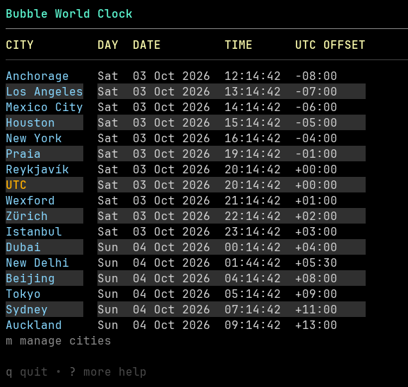

# Bubble World Clock

A terminal world clock built with [Bubble Tea](https://github.com/charmbracelet/bubbletea). Track local dates, times, and UTC offsets for cities from a bundled offline catalog.



## Install

Choose an installer below. It downloads the latest stable release, verifies its SHA-256 checksum, and installs the program for the current user without changing saved clock settings. Each example downloads the installer to a temporary file and runs it locally; do not pipe a remote script directly into a shell.

### Linux and macOS

Requires `curl`, `tar`, and `sha256sum` or `shasum`.

```sh
(
	set -e
	installer=$(mktemp "${TMPDIR:-/tmp}/bubbleworldclock-install.XXXXXX")
	trap 'rm -f "$installer"' EXIT HUP INT TERM
	curl -fL https://raw.githubusercontent.com/thomasjdelaney/BubbleWorldClock/master/scripts/install.sh -o "$installer"
	sh "$installer"
)
```

To choose a release version or installation directory:

```sh
(
	set -e
	installer=$(mktemp "${TMPDIR:-/tmp}/bubbleworldclock-install.XXXXXX")
	trap 'rm -f "$installer"' EXIT HUP INT TERM
	curl -fL https://raw.githubusercontent.com/thomasjdelaney/BubbleWorldClock/master/scripts/install.sh -o "$installer"
	sh "$installer" --version v1.2.3 --install-dir "$HOME/bin"
)
```

The default install directory is `~/.local/bin`. The installer adds it to `~/.profile` on Linux or `~/.zprofile` on macOS. Open a new terminal after installation. If you choose a custom directory, add it to PATH yourself.

### Windows

In PowerShell, download the script to a temporary file and run it:

```powershell
$installer = Join-Path ([IO.Path]::GetTempPath()) "bubbleworldclock-install-$([guid]::NewGuid()).ps1"
try {
	Invoke-WebRequest -Uri https://raw.githubusercontent.com/thomasjdelaney/BubbleWorldClock/master/scripts/install.ps1 -OutFile $installer -ErrorAction Stop
	& $installer
} finally {
	Remove-Item -LiteralPath $installer -Force -ErrorAction SilentlyContinue
}
```

If PowerShell blocks script execution, allow scripts for this session only with `Set-ExecutionPolicy -Scope Process -ExecutionPolicy Bypass`, then rerun the download-and-run block.

To choose a release version or installation directory:

```powershell
$installer = Join-Path ([IO.Path]::GetTempPath()) "bubbleworldclock-install-$([guid]::NewGuid()).ps1"
try {
	Invoke-WebRequest -Uri https://raw.githubusercontent.com/thomasjdelaney/BubbleWorldClock/master/scripts/install.ps1 -OutFile $installer -ErrorAction Stop
	& $installer -Version v1.2.3 -InstallDir "$env:LOCALAPPDATA\Programs\BubbleWorldClock"
} finally {
	Remove-Item -LiteralPath $installer -Force -ErrorAction SilentlyContinue
}
```

The default directory is `%LOCALAPPDATA%\Programs\BubbleWorldClock`; the installer adds it to your user PATH. Open a new terminal after installation. Windows ARM64 is not currently supported.

Linux users can also install from the `.deb` or `.rpm` packages on the [releases page](https://github.com/thomasjdelaney/BubbleWorldClock/releases).

## Use

Run `bubble-world-clock` (or `bubble-world-clock.exe` on Windows).

- `bubble-world-clock update`: check GitHub for a newer release and install it in place when available.
- `bubble-world-clock version`: print the installed version.
- On the clock screen, `m` opens city management, `?` shows help, and `q` or `Ctrl+C` quits.
- In city management, `a` adds a city, `d` removes the selected city, `o` cycles the sort order, and `u` toggles the saved UTC reference row. UTC is off by default and follows the active sort order when enabled. Use the arrow keys or `j`/`k` to move the selection.
- In the city picker, type a city name to search, or use `country:Japan` or `tz:Paris` to filter by country or timezone. Press `Enter` to add a city and `Esc` to return to management.
- If saving fails, press `s` to retry.

Your city list, sort order, and UTC setting are saved in the operating system's user config directory under `BubbleWorldClock/cities.json`. The offline city catalog is derived from GeoNames `cities15000` under CC BY 4.0; see [data/README.md](data/README.md) for attribution.

## Develop

Install Go 1.26.6 or newer, then run:

```sh
go run .
go test ./...
go vet ./...
```

## Release (maintainers)

Push a version tag to publish platform archives, Linux `.deb` and `.rpm` packages, and checksums:

```sh
git tag -a v1.0.0 -m "v1.0.0"
git push origin v1.0.0
```
